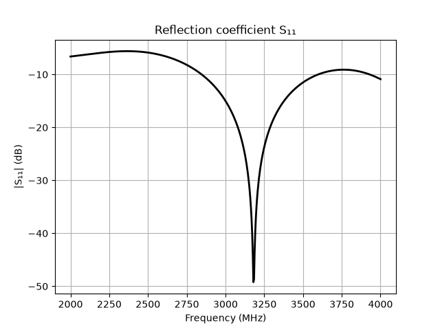
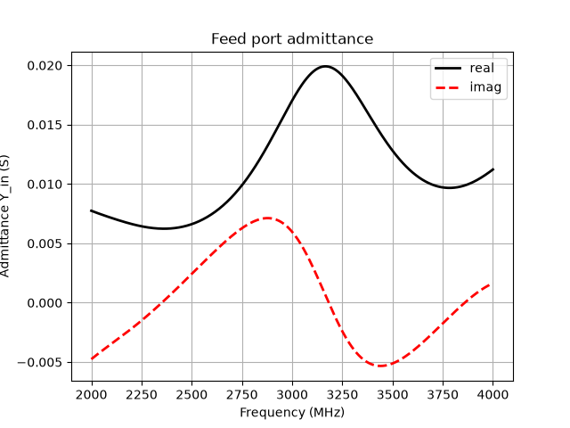
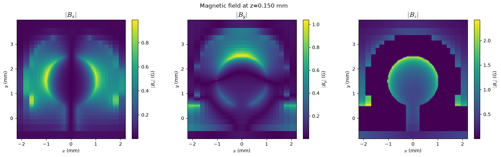
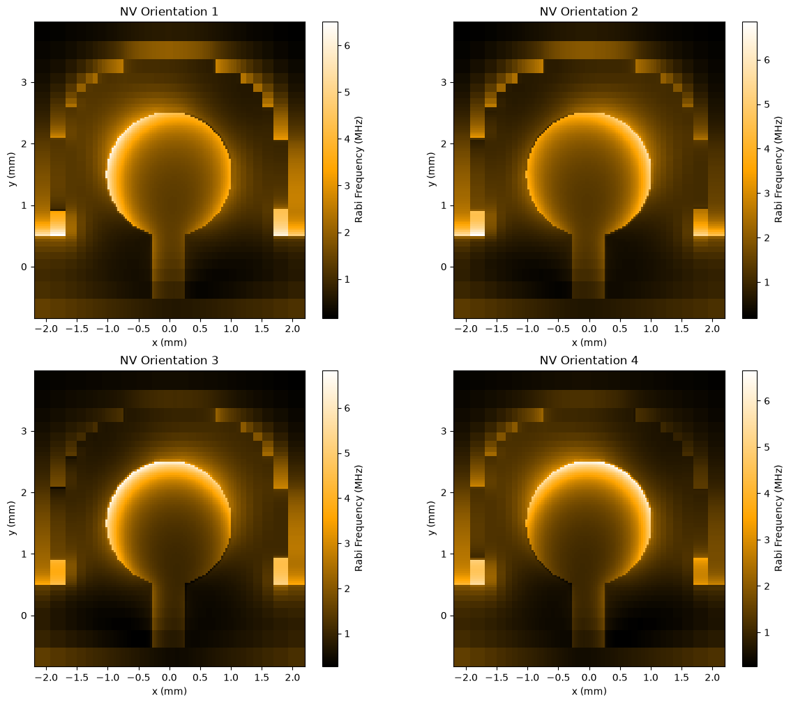

# Microwave Antenna for NV-Center Control

Simulation results for a planar microwave antenna (circular radiating pad with a feed line) designed to drive NV-center spin transitions around $`f \approx 3.2\,\mathrm{GHz}`$. The simulated band is $`2`$–$`4\,\mathrm{GHz}`$.

## Key Results

- **Resonance:** $`f_0 \approx 3.18\,\mathrm{GHz}`$
- **Matching:** $`|S_{11}| \approx -50\,\mathrm{dB}`$ at resonance
- **Feed admittance:** $`\mathrm{Re}(Y_{\mathrm{in}}) \approx 0.02\,\mathrm{S} = 1/(50\,\Omega)`$ near $`3.15\,\mathrm{GHz}`$, so the antenna is matched to a $`50\,\Omega`$ line
- **Rabi frequency:** up to $`\approx 6.5\,\mathrm{MHz}`$, strongest over the circular pad, for all four NV orientations

## 1. Reflection Coefficient $`S_{11}`$

Sharp resonance near $`3.18\,\mathrm{GHz}`$. The second plot shows the variant with gap $`= 1.0`$.

| Default | Gap = 1.0 |
|:---:|:---:|
|  |  |

## 2. Feed-Port Admittance

Real part peaks at $`\approx 0.02\,\mathrm{S}`$ near resonance, while the imaginary part crosses zero close to the same frequency.



## 3. Magnetic Field

Field components $`|B_x|`$, $`|B_y|`$ and $`|B_z|`$ at $`z = 0.150\,\mathrm{mm}`$ above the antenna. $`|B_z|`$ is largest and fairly uniform over the circular pad.



## 4. Rabi Frequency

Rabi frequency map for the four NV orientations, given by

```math
\Omega_R \propto |B_\perp|
```

where $`B_\perp`$ is the microwave field component perpendicular to the NV axis.

